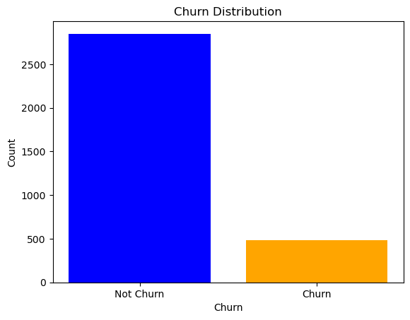
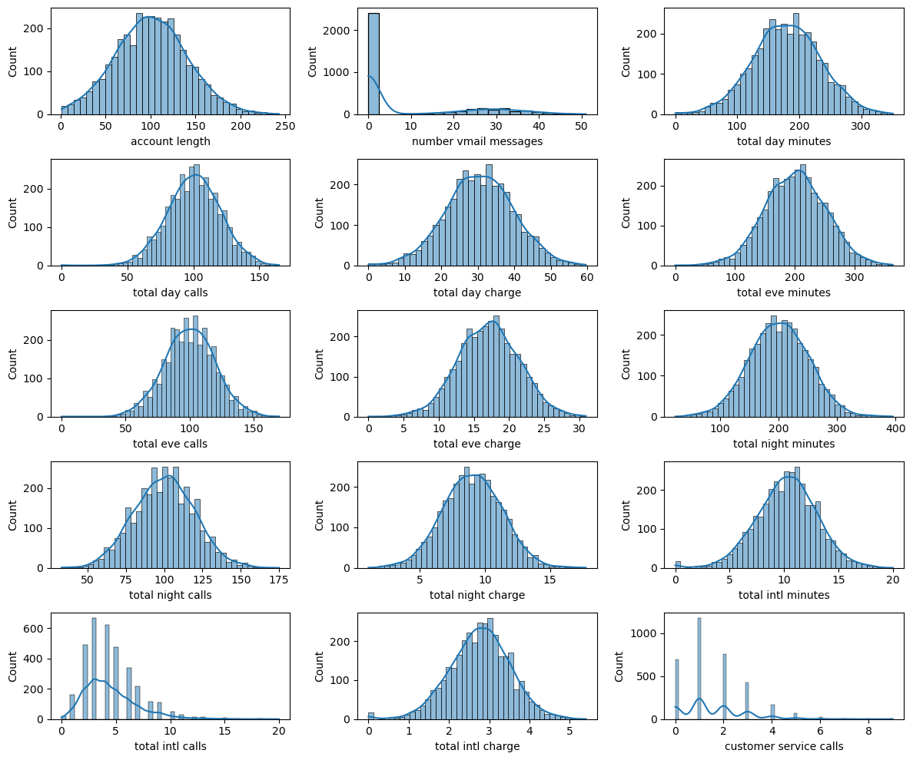
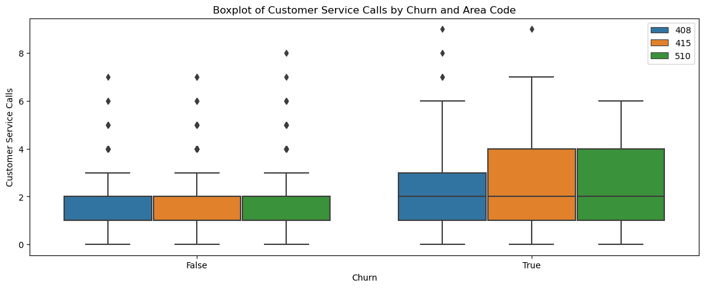

## Syriatel Customer Charn Prediction Project
## Overview
Syriatel is a telecommunication company founded in 2000 based in Syria with its headquarters in Damascus. It offers GSM,3G, and 4G network services.
Syriatel is faced with a challenge where there is a high churn rate with most of its customers abandoning their services and switching to their competitors.
 The company has identified this problem and is now seeking to build a classifier that will help them predict whether a customer will soon stop doing business with them. 
This will be done by proper analysis using their dataset to gain insights on what factors result in a high churning rate. A prediction model will be developed and this will provide insights and recommendations to the telecommunication company that will help them retain customers and avoid churning.
# Problem statement
To develop a machine learning model that can be used to predict and determine the probability of a customer churning a service and what factors result in this.
# Objectives
•	To identify the features that are likely to cause a customer to churn.
•	To develop a machine learning model that will accurately predict the customers that are at a high risk of churning.
•	To come up with measures to prevent customers who are at high risk from churning 
## Business Understanding.
Customer attrition, also known as churn, refers to the loss of clients or customers and is particularly pertinent to industries such as telephone service companies, internet service providers, TV companies, and insurance firms. Managing and mitigating customer attrition is a crucial concern for businesses in these sectors.
The primary objective of this project is to enhance customer retention by investigating the key factors associated with customers unsubscribing from a service, specifically within the telecommunication sector. The focus is on identifying patterns that may predict customer churn and devising strategies to address this phenomenon.
For the telecommunication company, the overarching goal is to minimize financial losses attributed to customers who discontinue their services. The project seeks to uncover discernible patterns in customer behavior leading churning.
## Data Understanding.
The data used has been sourced from Kaggle. The dataset contains a record of 3333 rows and 21 columns containing different features. Out of the 21 columns, 4 are categorical and 17 are numerical. The categorical features include:
1.	State -This is where the customer resides
2.	Phone number -The contact of the customer
The numerical features include:
1.	Area code - The area code associated with the customer's phone number.
2.	Account length - The number of days the customer has been an account holder.
3.	Number of v-mail messages - The number of voice mail messages received by the customer.
4.	Total day minutes - The total number of minutes the customer used during the day.
5.	Total day calls - The total number of calls made by the customer during the day.
6.	Total day charge - The total charges incurred by the customer for daytime usage.
7.	Total evening minutes - The total number of minutes the customer used during the evening.
8.	Total evening calls - The total number of calls the customer used during the evening.
9.	Total evening charge - The total charges incurred by the customer during the evening.
10.	Total night minutes - The total number of minutes the customer used during the night.
11.	Total night calls - The total number of minutes the customer used during the night.
12.	Total night charge - The total charges incurred by the customer for nighttime usage.
13.	Total international minutes - The total number of international minutes used by the customer.
14.	Total international calls - The total number of international calls used by the customer.
15.	Total international charge - The total charges incurred by the customer for international usage.
16.	Customer service calls - The number of customer service calls made by the customer.
17.	Churn – This is the target variable its binary (1 which means loss of client and 0 meaning loss of client.
## Data Preparation
# Data Cleaning
We went through the dataset and inspected if there were missing values and null values. From this process there were no missing values and null values This shows the dataset we are working with to be complete. There were no duplicates in the dataset. The column representing the phone number was dropped because it was not important for our modeling 
# Data Analysis
In the Exploratory Data Analysis process, we looked into the dataset by visually and statistically examining and understanding the data before further splitting it for more analysis and modelling.
# Univariate Analysis 
We started our analysis by looking into each of the features in our dataset starting with the target variable and visualizing it to see the distribution.

 
From the graph above about 483 customers out of the total 3333 in the dataset have churned (meaning terminated) their contracts with the telecommunication company.
A histogram showing the distribution of all the numerical features enabled us to see most of the features having a normal distribution curve.  

From the visualization above the observations on the distribution of the numerical features can be seen
 1. The distribution in the Account length is positively skewed, indicating that the majority of customers have shorter account lengths. This suggests potential inaccuracies in predicting customer churn, as longer account lengths might be a more accurate predictor.

 2. The distribution of the Number of Voice Mail Messages is relatively even, indicating that the number of voicemail messages is not a particularly strong predictor of customer churn.
 3. Total Day Minutes, Total Day Calls, and Total Day Charge: These features show a significant amount of potential noise in the data, as the distribution is positively skewed and there is a significant amount of overlap between the classes.

4. Total Evening Minutes, Calls, and Charge: These features show a similar pattern to the Total Day features, indicating potential noise and overlap between classes.

5. Total Nighttime Minutes, Calls, and Charge: The distribution of these features is negatively skewed, indicating that the majority of customers have less activity at night. This suggests potential inaccuracies in predicting customer churn, as higher activity at night might be a more accurate predictor.
6. Total International Minutes, Calls, and Charge: These features show a similar pattern to the Total Day features, indicating potential noise and overlap between classes.

7. The distribution of Customer Service Calls is negatively skewed, indicating that the majority of customers have fewer customer service calls. This suggests potential inaccuracies in predicting customer churn, as higher customer service calls might be a more accurate predictor.
The visualization below is for the categorical features.
 
 
From the plot above we can see states like West Virginia, Minnesota, New York, Alabama, and Wisconsin while California had the lowest number of customers
# Bivariate Analysis
We analyzed two features to explore their relationship and see how the changes in each feature affect the other. In the boxplot below we can conclude that most of the customers who have terminated their contract are from the area code 415 and 510.

 
# Dealing with Outliers
We removed the outliers from our data and remained with 3169.
Features Correlation
From the matrix, we can conclude that most of the features are not correlated. The features that are correlated have a strong positive relationship with the other features. This means when one feature increases, the other features also tend to increase.
Some of the features that are correlated are:
1. Total day charge and total day minutes features have a strong positive correlation.
2. Total evening charge and total evening minutes features have a strong positive correlation.
3. Total night charge and total night minutes features are fully positively correlated.
4. Total int charge and total int minutes features are fully positively correlated.
These features can be seen to fall on the dark blue grid which shows how strongly they are correlated

Some of the features that are close to 0 mean that there is no linear relationship between the features.
 Correlation values close to -1 mean that there is a strong negative relationship between the features. This means when one feature increases, the other feature tends to decrease.
For the perfectly correlated features, this is because the charges are a direct result of the minutes used. 

# Multicollinearity check
From the analysis, we found some features in the dataset that were highly correlated with each other. This will result in problems when we are doing our modeling. The rows and columns that were highly correlated by about 0.9 were dropped.
Feature Engineering
We transformed some of the features in our dataset to be more suitable for our modeling in machine learning algorithms. Some of the techniques employed were:
1.	Label Encoding which enabled the conversion of the categorical features (churn) which is our target. By assigning a unique integer yes with 1 and no with 0. This will enable modelling in Machine learning for the algorithm to work.
2.	One-Hot Encoding. The other categorical features like the state, area code, international plan, and voice mail plan were converted to a binary feature by assigning a value of 1 if the category is present and 0 if it's absent. This will prevent the model from assuming any ordinal relationship between the categories.
3.	Data scaling. The numerical features are scaled to ensure they are on a similar scale to prevent the domination of certain features in the model.
## Modeling
The dataset we are working on is an example of a binary classification problem that predicts churn (whether a customer will churn or not). This will use a basic logistic regression model. The model will be evaluated on the recall score. Specifically, if it achieves a recall score of above 75% or higher, it will be considered a success.

To accomplish the outlined objectives specified in the project proposal, we plan to leverage a combination of diverse machine learning algorithms. The selected algorithms, each offering unique advantages, are tailored to address specific aspects of the project requirements. The following algorithms will be employed:
1. Logistic Regression
2. Decision Tree
3. Random Forest

In the assessment of our model performances, the ROC_AUC metric will be employed as a key evaluation measure. The ROC_AUC is a comprehensive metric particularly well-suited for binary classification problems. It considers both sensitivity and specificity across various threshold levels, providing a robust indication of a model's ability to discriminate between classes.

Addressing the challenge of class imbalance within our dataset, we will SMOTE. Class imbalance, where one class significantly outnumbers the other, can lead to biased models that predominantly predict the majority class. SMOTE will serve as a crucial technique for mitigating this imbalance by generating synthetic instances of the minority class, thereby leveling the playing field during model training.

# Logistic Regression
The logistic regression model exhibits a commendable recall score of 0.76, which, given its status as a baseline model, reflects strong performance. This score signifies the model's capability to accurately identify approximately 76% of actual positive instances. Despite its foundational nature, the model demonstrates effectiveness in capturing instances of interest, making it a valuable component of the predictive framework.
# Decision Trees
The recall score of the decision tree model stands at 0.76, a commendable performance that falls slightly short of surpassing our baseline model. This score implies that the model proficiently identifies approximately 76% of actual positive instances. While not an improvement over the baseline, the model's ability to capture a substantial portion of positive instances indicates its effectiveness in identifying potential cases of interest.
# Random Forest
The random forest classifier model exhibits an improved recall score of 0.79, showcasing a notable enhancement over its predecessor. This implies that the model accurately identifies approximately 79% of the actual positive instances.

Upon evaluation through the confusion matrix, it becomes evident that the model achieves a higher count of true positives and true negatives in comparison to false positives and false negatives. This suggests a robust performance, emphasizing the model's ability to make correct predictions more frequently than incorrect ones, indicative of its avoidance of overfitting.

As per the model's analysis, the top three most influential features are identified as total day charge, total international calls, and total evening charge.
Evaluation
classifiers                     
Logistic Regression      0.755319
RandomForestClassifier  0.787234
DecisionTreeClassifier  0.755319
The results table shows that RandomForestClassifier has the highest score followed by LogisticRegression and The DecisionTreeClassifier has the lowest recall score of 0.76.

# Model Comparison
# Model Tuning
The tuned Random Forest model demonstrates strong performance in discerning between positive (churned) and negative (non-churned) customer classes, particularly in accurately identifying churned customers. The model achieves a recall score of 0.76, indicating its ability to correctly capture 76% of the actual churned customers.

## Recommendations
In response to the observed higher churn rates in area codes 415 and 510, it is recommended to implement targeted promotional strategies, specifically offering discounts and promotional offers to customers within these areas. By providing incentives, such as exclusive discounts, the aim is to foster customer loyalty and discourage churn. This localized approach acknowledges the unique characteristics and challenges associated with these specific geographical regions.

Additionally, recognizing the critical role of customer service in customer retention, there is a proposal to invest in improving the quality of customer service. This involves enhancing the training programs for customer service representatives, equipping them with the skills and knowledge to promptly and effectively address customer issues. The objective is to elevate customer satisfaction levels and, consequently, reduce the likelihood of churn. By minimizing the need for customers to reach out with concerns, this initiative contributes to a smoother overall customer experience.

An evaluation of the existing pricing structure for day, evening, night, and international charges is recommended. Considering the impact of charges on customer decisions to churn, there is a suggestion to explore adjustments to pricing plans or the introduction of discounted packages. This strategic pricing review aims to address any discrepancies and make the company's offerings more competitive, ultimately mitigating factors that contribute to customer churn.
Next Steps
To further enrich the company's service offerings, there is a proposal to enhance the value proposition of the voicemail plan. By showcasing the benefits and convenience of voicemail services and potentially introducing additional features or discounts, the goal is to increase adoption among customers. This approach aligns with the broader objective of diversifying and maximizing the appeal of the company's service portfolio to strengthen customer loyalty and retention.

